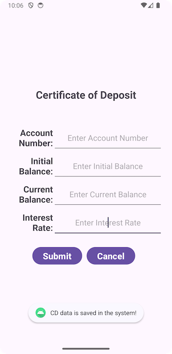

# VS-Finances

## Description
MyFinances is a simple Android app that helps users store Certificates of Deposit (CD), Loans, and Checking Account information. MyFinances app accepts the user input through a radio button option and navigates the user to the corresponding screens. Each screen has user entry fields, a submit, and a cancel button. The submit will accept the user data and store them in the database, and the cancel button will take the user back to the home screen. The app was developed on Android Studio in Java and Kotlin to generate Gradle scripts.

## Screenshots

### Homepage

### CD Form

### CD Form on Save

### Loans Form

### Loans Form on Save

### Checking Accounts Form

### Checking Accounts Form on Save

## License

  
